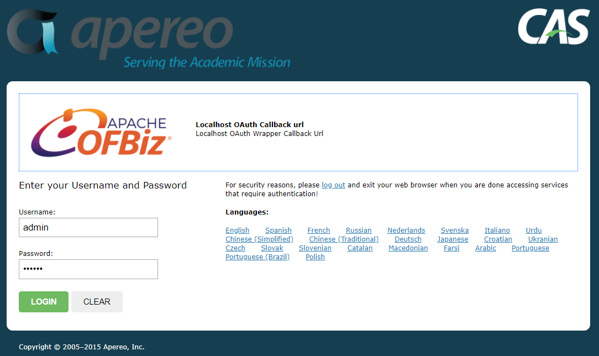
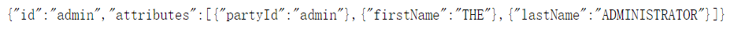

OFBiz-CAS Plugin
====
[中文](README_zh.md)


### License
[Apache License V2.0](LICENSE.txt)


### Contributions
If you have already identified an enhancement or a bug, it is STRONGLY recommended that you simply submit a pull request to address the case. There is no need for special ceremony to create separate issues. The pull request IS the issue and it will be tracked and tagged as such.


### Functions
1. Use OFBiz entity engine to store CAS TicketGrantingTicket, ServiceTicket, RegisteredService and etc.
2. Support OAuth login with OFBiz username and password.
3. Support OFBiz login policy, when max.failed.logins reached, the user login will be disabled for the minutes configured by login.disable.minutes.
4. Import service configurations from json files under runtime/cas/services into CasRegisteredService table when there is no data in the table.
5. The OAuth protocol supported as described in [https://apereo.github.io/cas/4.2.x/installation/OAuth-OpenId-Authentication.html](CAS document).


### Configurations

** Developed and tested in OFBiz 17.12 **

1. Modify ${ofbiz.home}/build.gradle：

** Make log4j2-cas.xml work: **

```groovy
def jvmArguments = ['-Xms1024M', '-Xmx2048M',
                    '-Dfile.encoding=UTF-8',
                    '-Dlog4j.configurationFile=log4j2.xml,log4j2-cas.xml']
...
compile 'com.lmax:disruptor:3.4.2'
```

** Delegate slf4j、 JCL and java.util.logging to log4j2 by slf4j-api, and logs are written to files by log4j2 in compliance with OFBiz. **

[See SLF4J for details](https://www.slf4j.org/legacy.html)

```groovy
subprojects {
    configurations {
        // compile-time plugin libraries
        pluginLibsCompile {
            exclude module:'log4j-slf4j-impl'
            exclude module:'log4j-jcl'
        }
        // runtime plugin libraries
        pluginLibsRuntime {
            exclude module:'log4j-slf4j-impl'
            exclude module:'log4j-jcl'
        }
        //compile-only libraries
        pluginLibsCompileOnly
    }
}
```

** Check whether the dependencies are correct **

```
./gradlew dependencies --configuration runtime > dependencies.txt
```

2. Add the cas plugin in ${ofbiz.home}/plugins/component-load.xml:

```xml
    <load-component component-location="cas"/>
```

3. Create directory runtime/cas/services and add service configuration files in the directory:

** runtime/cas/services/LocalhostHttps-10000002.json **

```json
{
  "@class" : "org.jasig.cas.support.oauth.services.OAuthRegisteredService",
  "clientId": "clientId",
  "clientSecret": "clientSecret",
  "bypassApprovalPrompt": true,
  "serviceId" : "^https://localhost:8443/.*",
  "name" : "OFBiz OAuth2",
  "id" : 10000002,
  "logo": "https://ofbiz.apache.org/images/ofbiz_logo.png",
  "attributeReleasePolicy" : {
    "@class" : "org.jasig.cas.services.ReturnAllowedAttributeReleasePolicy",
    "allowedAttributes" : [ "java.util.ArrayList", [ "partyId", "groupMembership", "firstName", "lastName" ] ],
    "principalAttributesRepository" : {
      "@class" : "org.jasig.cas.authentication.principal.DefaultPrincipalAttributesRepository"
    },
    "authorizedToReleaseCredentialPassword" : false,
    "authorizedToReleaseProxyGrantingTicket" : false
  }
}
```

** runtime/cas/services/LocalhostOAuthCallbackurl-10000003.json **

```json
{
  "@class": "org.jasig.cas.support.oauth.services.OAuthCallbackAuthorizeService",
  "serviceId": "https://localhost:8443/oauth/v2/callbackAuthorize",
  "name": "Localhost OAuth Callback url",
  "id": "10000003",
  "description": "Localhost OAuth Wrapper Callback Url",
  "evaluationOrder": "0",
  "logo": "https://ofbiz.apache.org/images/ofbiz_logo.png",
  "logoutType": "BACK_CHANNEL",
  "accessStrategy":
  {
    "@class": "org.jasig.cas.services.DefaultRegisteredServiceAccessStrategy",
    "enabled": "true",
    "ssoEnabled": "true",
    "requireAllAttributes": "true",
    "caseInsensitive": "false"
  }
}
```

4. Start OFBiz:

```
./gradlew ofbiz
```

5. Tests:

** Login: /oauth/v2/authorize **

```
Url example:  https://localhost:8443/oauth/v2/authorize?response_type=code&client_id=clientId&redirect_uri=https://localhost:8443/webtools/control/ping
```




** Authorize to the application: /oauth/v2/callbackAuthorize **


** Get access_token: /oauth/v2/accessToken **

```
Url example:  https://localhost:8443/oauth/v2/accessToken?grant_type=authorization_code&client_id=clientId&&client_secret=clientSecret&redirect_uri=https://localhost:8443/webtools/control/ping&code=CODE
```


** Get profile: /oauth/v2/profile **

```
Url example:  https://localhost:8443/oauth/v2/profile?access_token=ACCESS_TOKEN
```




### Development Note

[See development readme](DEV_README.md)
