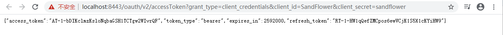
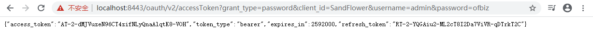

[English](README.md) | [中文](docs/README_ZH.md)


# OFBiz-CAS Plugin


### License
[Apache License V2.0](LICENSE)

<br/>

### Contributions
Welcome any kind of contributions to this plugin.

<br/>

### Environment
This plugin is for OFBiz 17.12.03 with JDK 1.8.x, Tomcat 9.0.31 and CAS 5.3.15.1.

<br/>

### Quick Start

**1. Checkout OFBiz 17.12.03 from https://github.com/apache/ofbiz-framework**

<br/>

**2. Download this plugin**

<br/>

**3. Deploy this plugin in plugins/cas/**

<br/>

**4. Apply patches under patches/ofbiz to OFBiz**

<br/>

**5. Edit gradle/wrapper/gradle-wrapper.properties, change to use gradle 5.0:**

```
distributionUrl=https\://services.gradle.org/distributions/gradle-5.0-bin.zip
```

<br/>

**6. Install OFBiz seed data by command:**

```
gradlew loadAll
```

<br/>

**7. Config CAS:**

Deploy [the demo configuration file](docs/LocalhostHttps-10000002.json) to runtime/cas/services folder.


<br/>

The content of LocalhostHttps-10000002.json is here:

```json
{
  "@class" : "org.apereo.cas.support.oauth.services.OAuthRegisteredService",
  "clientId": "SandFlower",
  "clientSecret": "sandflower",
  "bypassApprovalPrompt": true,
  "serviceId" : "^https://localhost:8443/.*",
  "name" : "OFBiz OAuth2",
  "id" : 10000002,
  "logo": "https://ofbiz.apache.org/images/ofbiz_logo.png",
  "evaluationOrder": 10,
  "jsonFormat": true,
  "supportedGrantTypes": [ "java.util.HashSet", [ "AUTHORIZATION_CODE", "PASSWORD", 
                                                  "CLIENT_CREDENTIALS", "REFRESH_TOKEN" ] ],
  "generateRefreshToken": true,
  "attributeReleasePolicy" : {
    "@class" : "org.apereo.cas.services.ReturnAllowedAttributeReleasePolicy",
    "allowedAttributes" : [ "java.util.ArrayList", 
                            [ "userLoginId", "partyId", "groupName", "firstName", "lastName", "currentPassword" ]
                          ],
    "principalAttributesRepository" : {
      "@class" : "org.apereo.cas.authentication.principal.DefaultPrincipalAttributesRepository"
    },
    "authorizedToReleaseCredentialPassword" : false,
    "authorizedToReleaseProxyGrantingTicket" : false
  },
  "accessStrategy" : {
    "@class" : "org.apereo.cas.services.DefaultRegisteredServiceAccessStrategy",
    "enabled" : true,
    "ssoEnabled" : true,
    "requireAllAttributes" : false
  }
}
```

<br/>

**8. Start OFBiz by command:**

```
gradlew ofbiz
```

<br/>

**9. CAS native login test:**

In browser, visit https://localhost:8443/oauth/login


<br/>

**Username:** admin

**Password:** ofbiz

After login successfully, you can see this page:


<br/>

**10. OAuth2 Grant Tests:**

The OAuth2 grant supported as described in [https://apereo.github.io/cas/5.3.x/installation/OAuth-OpenId-Authentication.html](CAS document).


<br/>

As you see, there are 4 grant types of OAuth2: Client Credentials Grant, Password Grant, Authorization Code Grant and Implicit Grant. Let's test them one by one.

<br/>

**10.1. Client Credentials Grant: /oauth/v2/accessToken**

This is one step authorization.

```
Url example:
https://localhost:8443/oauth/v2/accessToken?grant_type=client_credentials&client_id=SandFlower&client_secret=sandflower
```



<br/>

**10.2 Password Grant: /oauth/v2/accessToken**

This is one step authorization.

```
Url example:
https://localhost:8443/oauth/v2/accessToken?grant_type=password&client_id=SandFlower&username=admin&password=ofbiz
```



<br/>

**10.3 Authorization Code Grant**

This 2 steps authorization.

The 1st step: authorize and get code from the redirected url.

```
Url example:
https://localhost:8443/oauth/v2/authorize?response_type=code&client_id=SandFlower&redirect_uri=https://localhost:8443/webtools/control/ping
```

The redirected url is:


<br/>

The 2nd step: get access_token

Replace CODE in the following url from the 1st step redirected url and request the following url in browser.

```
Url example:
https://localhost:8443/oauth/v2/accessToken?grant_type=authorization_code&client_id=SandFlower&client_secret=sandflower&redirect_uri=https://localhost:8443/webtools/control/ping&code=CODE
```


<br/>

**10.4 Implicit Grant: /oauth/v2/authorize**

```
Url example:
https://localhost:8443/oauth/v2/authorize?response_type=token&client_id=SandFlower&redirect_uri=https://localhost:8443/webtools/control/ping
```

The redirected url look like:


<br/>

**11. OAuth2 Refresh Token Grant Test: /oauth/v2/accessToken**

You can always use refresh token to get a new access token.

```
Url example:
https://localhost:8443/oauth/v2/accessToken?grant_type=refresh_token&client_id=SandFlower&client_secret=sandflower&refresh_token=REFRESH_TOKEN
```

In 10.2 Password Grant, you get a refresh token, replace the REFRESH_TOKEN with it in the above url, visit the url in web browser, you'll get a new access token.


**12. OAuth2 profile test: /oauth/v2/profile**

The user profile can be fetched by the access token, i.e. in 10.2 Password Grant, you get an access token, replace ACCESS_TOKEN in the following url with the access token and visit it in a web browser.

```
Url example:
https://localhost:8443/oauth/v2/profile?access_token=ACCESS_TOKEN
```

The user profile in web browser:


<br/>

**13. OpenAPI Demo: /openapi-demo/**

There is an openapi-demo webapp to show how to use this plugin in openapi.

13.1 Visit https://localhost:8443/openapi-demo/, click "Demo OpenAPIs" in the left frame:


13.2 Click "Authorize" button, input username, password and client id:


13.3 Click "Authorize" button to store oauth2 parameters:


13.4 Click "Try it out" button and then "Execute" button, check the response from the demo 


<br/>

### Development Note

**1. How to build webapp/cas-5.3.15.1 for this plugin**

1.1 Check out [cas-overlay-template-ofbiz](https://github.com/langhua/cas-overlay-template-ofbiz/), select ofbiz-17.12.03-cas-5.3.15.1 tag.

1.2 Run 'mvn clean package' to build target/cas-5.3.15.1, it's the webapp/cas-5.3.15.1 in this plugin.


<br/>

**2. Why apply patches/ofbiz/startup-with-webapp-context.xml.patch**

As you see, when deploying Apereo CAS in tomcat, the META-INF/context.xml is applied. In OFBiz 17.12.03, it's not. With patches/ofbiz/startup-with-webapp-context.xml.patch, META-INF/context.xml is configured, and then spring-boot and relative jars can be scanned and loaded as expected.

```java
         StandardContext context = new StandardContext();
+        String location = getWebappRootLocation(appInfo);
+
+        String contextXmlFilePath = new StringBuilder().append("file:///").append(location).append("/").append(Constants.ApplicationContextXml).toString();
+        URL contextXmlUrl = null;
+        try {
+            contextXmlUrl = FlexibleLocation.resolveLocation(contextXmlFilePath);
+            contextXmlFilePath = new StringBuilder().append(location).append("/").append(Constants.ApplicationContextXml).toString();
+            File contextXmlFile = FileUtil.getFile(contextXmlFilePath);
+            if(contextXmlFile.exists() && contextXmlFile.isFile()) { 
+                Debug.logInfo(contextXmlFilePath + " found and will be loaded.", module);
+                context.setConfigFile(contextXmlUrl);
+            } else {
+                // Debug.logInfo(contextXmlFilePath + " not found or not a file.", module);
+            }
+        } catch (MalformedURLException e) {
+            Debug.logInfo(contextXmlFilePath+ " not found.", module);
+        }
+
         Tomcat.initWebappDefaults(context);
 
-        String location = getWebappRootLocation(appInfo);
```

context.setConfigFile(contextXmlUrl) is the core line.

<br/>

**3. Why apply patches/ofbiz/build.gradle.patch**

In this patch, rootProject.jvmArguments is exposed to submodule's build.gradle to extend or change them:

```groovy
-List jvmArguments = ['-Xms128M', '-Xmx1024M']
+ext.jvmArguments = ['-Xms128M', '-Xmx1024M']
```

and then in the build.gradle of OFBiz-CAS plugin, the rootProject.jvmArguments are extended:

```groovy
rootProject.jvmArguments.each { jvmArg ->
    if (jvmArg && jvmArg.startsWith("-Dlog4j.configurationFile=")) {
        originalLog4jConfig = jvmArg
        if (!jvmArg.endsWith("=")) {
            jvmArg += ","
        }
        log4jConfig = jvmArg + "log4j2-cas.xml"
        findLogArg = true
        return true
    }
}
if (!findLogArg) {
    rootProject.jvmArguments.add('-Dlog4j.configurationFile=log4j2.xml,log4j2-cas.xml')
} else {
    rootProject.jvmArguments.remove(originalLog4jConfig)
    rootProject.jvmArguments.add(log4jConfig)
}

...
rootProject.jvmArguments.add('-Dcas.standalone.configurationDirectory=plugins/cas/config')
...
```

<br/>

**4. Why apply patches/cas/cas-server-support-oauth-core-5.3.15.1.patch**

This patch is for [cas-server-support-oauth-core](https://github.com/apereo/cas/tree/v5.3.15.1/support/cas-server-support-oauth-core).

The code changes "/oauth2.0" to "/v2":

```java
public interface OAuth20Constants {
...
-    String BASE_OAUTH20_URL = "/oauth2.0";
+    String BASE_OAUTH20_URL = "/v2";
...
}
```

This is a sample if you want to change the default /oauth2.0 uri style.

Run 'mvn clean package' in support/cas-server-support-oauth-core, and then copy support/cas-server-support-oauth-core/build/libs/cas-server-support-oauth-core-5.3.15.1.jar and support/cas-server-support-oauth/build/libs/cas-server-support-oauth-5.3.15.1.jar to this plugin's lib folder.


The reason why cas-server-support-oauth-5.3.15.1.jar is required, is that Java sets all BASE_OAUTH20_URL to '/oauth2.0' during compiling, and there are several usages of BASE_OAUTH20_URL in cas-server-support-oauth.

If you don't want to change "/oauth2.0", remove these 2 jars.

<br/>

**5. Why apply patches/java-cas-client/cas-client-core-3.5.1.patch**

This patch is for [cas-client-core](https://github.com/apereo/java-cas-client/tree/cas-client-3.5.1/cas-client-core) to resolve ssl error in localhost environment. By default, test cases in 10.3 and 10.4 will be failed:


After input username admin, password ofbiz, an error page shown:


<br/>

Thanks for reading this document.

--- END ---