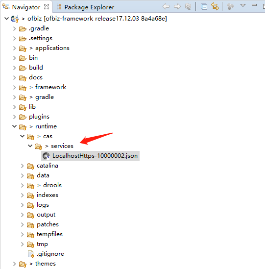
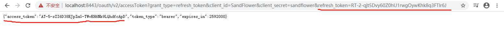
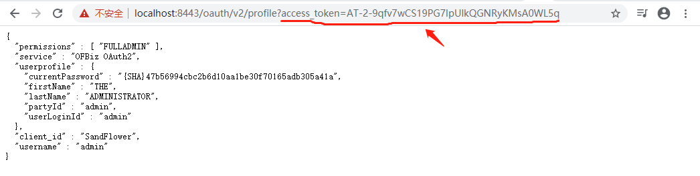
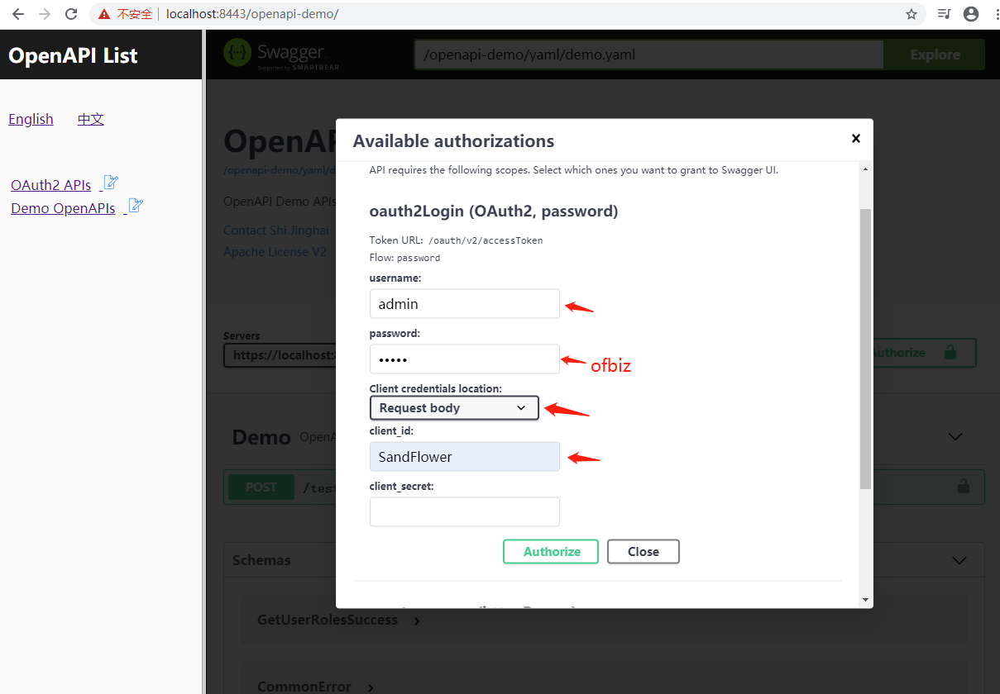
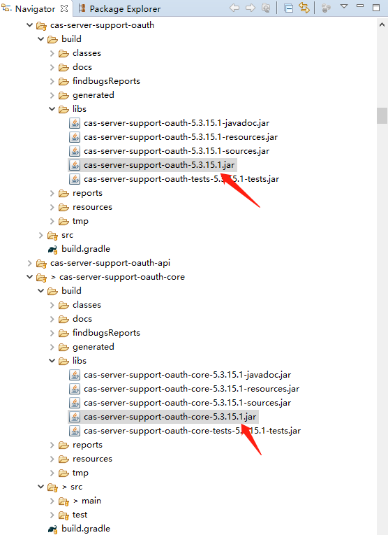
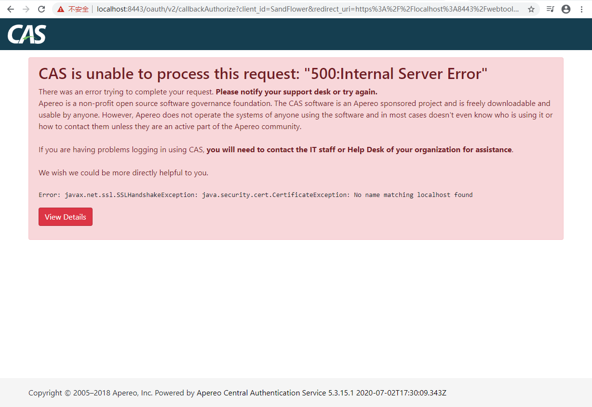

[English](../README.md) | [中文](README_ZH.md)

# OFBiz-CAS模块


### 版权
[Apache License V2.0](LICENSE)

<br/>

### 贡献
欢迎你对本模块做贡献。

<br/>

### 环境
本模块用于OFBiz 17.12.03、JDK 1.8.x、Tomcat 9.0.31以及CAS 5.3.15.1。

<br/>

### 快速启动

**1. 从https://github.com/apache/ofbiz-framework检出OFBiz 17.12.03**

<br/>

**2. 下载本模块**

<br/>

**3. 把本模块部署到plugins/cas/**

<br/>

**4. 把patches/ofbiz下的补丁打到OFBiz中**

<br/>

**5. 编辑gradle/wrapper/gradle-wrapper.properties文件，改为使用gradle 5.0:**

```
distributionUrl=https\://services.gradle.org/distributions/gradle-5.0-bin.zip
```

<br/>

**6. 安装OFBiz种子数据:**

```
gradlew loadAll
```

<br/>

**7. 配置CAS:**

把[演示用配置文件](LocalhostHttps-10000002.json)部署到runtime/cas/services目录下。



<br/>

LocalhostHttps-10000002.json的文件内容如下:

```json
{
  "@class" : "org.apereo.cas.support.oauth.services.OAuthRegisteredService",
  "clientId": "SandFlower",
  "clientSecret": "sandflower",
  "bypassApprovalPrompt": true,
  "serviceId" : "^https://localhost:8443/.*",
  "name" : "OFBiz OAuth2",
  "id" : 10000002,
  "logo": "https://ofbiz.apache.org/images/ofbiz_logo.png",
  "evaluationOrder": 10,
  "jsonFormat": true,
  "supportedGrantTypes": [ "java.util.HashSet", [ "AUTHORIZATION_CODE", "PASSWORD", 
                                                  "CLIENT_CREDENTIALS", "REFRESH_TOKEN" ] ],
  "generateRefreshToken": true,
  "attributeReleasePolicy" : {
    "@class" : "org.apereo.cas.services.ReturnAllowedAttributeReleasePolicy",
    "allowedAttributes" : [ "java.util.ArrayList", 
                            [ "userLoginId", "partyId", "groupName", "firstName", "lastName", "currentPassword" ]
                          ],
    "principalAttributesRepository" : {
      "@class" : "org.apereo.cas.authentication.principal.DefaultPrincipalAttributesRepository"
    },
    "authorizedToReleaseCredentialPassword" : false,
    "authorizedToReleaseProxyGrantingTicket" : false
  },
  "accessStrategy" : {
    "@class" : "org.apereo.cas.services.DefaultRegisteredServiceAccessStrategy",
    "enabled" : true,
    "ssoEnabled" : true,
    "requireAllAttributes" : false
  }
}
```

<br/>

**8. 启动OFBiz:**

```
gradlew ofbiz
```

<br/>

**9. CAS登录测试:**

在浏览器中，访问https://localhost:8443/oauth/login


<br/>

**用户名:** admin

**密码:** ofbiz

成功登录后，会看到下面这个页面:


<br/>

**10. OAuth2认证测试用例:**

OAuth2认证支持的方式，在 [https://apereo.github.io/cas/5.3.x/installation/OAuth-OpenId-Authentication.html](CAS文档)中有详细说明。


<br/>

可以看到，有四种OAuth2认证方式：客户认证、密码认证、授权码认证和隐式认证。下面一个一个测试这些认证方式。

<br/>

**10.1. 客户认证: /oauth/v2/accessToken**

这是一步完成的认证，常用于机器间/系统间的认证。

```
网址样例:
https://localhost:8443/oauth/v2/accessToken?grant_type=client_credentials&client_id=SandFlower&client_secret=sandflower
```


<br/>

**10.2 密码认证: /oauth/v2/accessToken**

这是一步完成的认证，常用于单页应用。

```
网址样例:
https://localhost:8443/oauth/v2/accessToken?grant_type=password&client_id=SandFlower&username=admin&password=ofbiz
```


<br/>

**10.3 授权码认证**

这是两步认证。

第一步: 认证并从跳转的网址中得到认证码。

```
网址样例:
https://localhost:8443/oauth/v2/authorize?response_type=code&client_id=SandFlower&redirect_uri=https://localhost:8443/webtools/control/ping
```

跳转的网址是:


<br/>

第二步: 获得access_token

把下面样例网址中的CODE，替换为第一步认证跳转页面中的认证码，然后在浏览器中访问这个替换后的样例网址。

```
网址样例:
https://localhost:8443/oauth/v2/accessToken?grant_type=authorization_code&client_id=SandFlower&client_secret=sandflower&redirect_uri=https://localhost:8443/webtools/control/ping&code=CODE
```


<br/>

**10.4 隐式认证: /oauth/v2/authorize**

```
网址样例:
https://localhost:8443/oauth/v2/authorize?response_type=token&client_id=SandFlower&redirect_uri=https://localhost:8443/webtools/control/ping
```

跳转后的网址类似下图所示:


<br/>

**11. OAuth2 Refresh Token（刷新令牌）认证测试: /oauth/v2/accessToken**

你总是能用refresh token来获取一个新的access token（访问令牌）。

```
网址样例:
https://localhost:8443/oauth/v2/accessToken?grant_type=refresh_token&client_id=SandFlower&client_secret=sandflower&refresh_token=REFRESH_TOKEN
```

在10.2密码认证中，你能得到一个refresh token，用它来替换上面网址中的REFRESH_TOKEN，然后在浏览器中访问替换后的网址，即可得到一个新的access token。




**12. OAuth2用户资料测试: /oauth/v2/profile**

可以使用access token来获取用户资料，比如在10.2密码认证中，你得到了一个access token，用它替换下面网址中的ACCESS_TOKEN，然后在浏览器中访问替换后的网址。

```
网址样例:
https://localhost:8443/oauth/v2/profile?access_token=ACCESS_TOKEN
```

浏览器中会显示用户资料:



<br/>

**13. OpenAPI演示: /openapi-demo/**

本模块还带了一个openapi-demo，演示如何在openapi中使用本模块。

13.1 在浏览器中访问https://localhost:8443/openapi-demo/index_zh.html，点击左侧的"开放接口演示":


13.2 点击"Authorize"（认证）按钮，数据username、password和client_id:



13.3 点击"Authorize"按钮会保存oauth2参数:


13.4 点击"Try it out"（试一试）按钮，然后点击"Execute"（执行）按钮，查看演示返回的数据


<br/>

### 开发笔记

**1. 如何构建本模块的webapp/cas-5.3.15.1？**

1.1 检出[cas-overlay-template-ofbiz](https://github.com/langhua/cas-overlay-template-ofbiz/)，选择 ofbiz-17.12.03-cas-5.3.15.1标签。

1.2 运行'mvn clean package'来构建target/cas-5.3.15.1，该目录即是本模块的webapp/cas-5.3.15.1。


<br/>

**2. 为什么打补丁patches/ofbiz/startup-with-webapp-context.xml.patch？**

当把Apereo CAS部署到Tomcat里时，META-INF/context.xml会起作用。OFBiz 17.12.03中，它不起作用。打了patches/ofbiz/startup-with-webapp-context.xml.patch这个补丁后，META-INF/context.xml就生效了，然后spring-boot以及相关的jar都会如预期一样被扫描和加载。

```java
         StandardContext context = new StandardContext();
+        String location = getWebappRootLocation(appInfo);
+
+        String contextXmlFilePath = new StringBuilder().append("file:///").append(location).append("/").append(Constants.ApplicationContextXml).toString();
+        URL contextXmlUrl = null;
+        try {
+            contextXmlUrl = FlexibleLocation.resolveLocation(contextXmlFilePath);
+            contextXmlFilePath = new StringBuilder().append(location).append("/").append(Constants.ApplicationContextXml).toString();
+            File contextXmlFile = FileUtil.getFile(contextXmlFilePath);
+            if(contextXmlFile.exists() && contextXmlFile.isFile()) { 
+                Debug.logInfo(contextXmlFilePath + " found and will be loaded.", module);
+                context.setConfigFile(contextXmlUrl);
+            } else {
+                // Debug.logInfo(contextXmlFilePath + " not found or not a file.", module);
+            }
+        } catch (MalformedURLException e) {
+            Debug.logInfo(contextXmlFilePath+ " not found.", module);
+        }
+
         Tomcat.initWebappDefaults(context);
 
-        String location = getWebappRootLocation(appInfo);
```

context.setConfigFile(contextXmlUrl)是核心代码。

<br/>

**3. 为什么打patches/ofbiz/build.gradle.patch补丁**

这个补丁，把rootProject.jvmArguments暴露出来，让模块的build.gradle能扩展或修改:

```groovy
-List jvmArguments = ['-Xms128M', '-Xmx1024M']
+ext.jvmArguments = ['-Xms128M', '-Xmx1024M']
```

在OFBiz-CAS模块的build.gradle中，rootProject.jvmArguments被扩展了:

```groovy
rootProject.jvmArguments.each { jvmArg ->
    if (jvmArg && jvmArg.startsWith("-Dlog4j.configurationFile=")) {
        originalLog4jConfig = jvmArg
        if (!jvmArg.endsWith("=")) {
            jvmArg += ","
        }
        log4jConfig = jvmArg + "log4j2-cas.xml"
        findLogArg = true
        return true
    }
}
if (!findLogArg) {
    rootProject.jvmArguments.add('-Dlog4j.configurationFile=log4j2.xml,log4j2-cas.xml')
} else {
    rootProject.jvmArguments.remove(originalLog4jConfig)
    rootProject.jvmArguments.add(log4jConfig)
}

...
rootProject.jvmArguments.add('-Dcas.standalone.configurationDirectory=plugins/cas/config')
...
```

<br/>

**4. 为什么打patches/cas/cas-server-support-oauth-core-5.3.15.1.patch补丁**

这个补丁是用在[cas-server-support-oauth-core](https://github.com/apereo/cas/tree/v5.3.15.1/support/cas-server-support-oauth-core)的。

是把"/oauth2.0"改成了"/v2":

```java
public interface OAuth20Constants {
...
-    String BASE_OAUTH20_URL = "/oauth2.0";
+    String BASE_OAUTH20_URL = "/v2";
...
}
```

当你需要修改/oauth2.0时，可以参考这个例子。

在support/cas-server-support-oauth-core中运行'mvn clean package'，然后把support/cas-server-support-oauth-core/build/libs/cas-server-support-oauth-core-5.3.15.1.jar和support/cas-server-support-oauth/build/libs/cas-server-support-oauth-5.3.15.1.jar复制到本模块的lib目录下。



必须复制cas-server-support-oauth-5.3.15.1.jar的原因，是Java会在编译时，把所有BASE_OAUTH20_URL都替换为'/oauth2.0'，而在cas-server-support-oauth中，有几个地方用到了BASE_OAUTH20_URL。

如果你不要修改"/oauth2.0"，删除这两个jar文件即可。

<br/>

**5. 为什么打patches/java-cas-client/cas-client-core-3.5.1.patch补丁**

这个补丁用于[cas-client-core](https://github.com/apereo/java-cas-client/tree/cas-client-3.5.1/cas-client-core)，以解决在本地环境中ssl错误的问题。缺省情况下，本地10.3和10.4的测试会失败:


输入用户名admin、密码ofbiz后，会出现错误页面:




<br/>

感谢阅读本文档。

--- 本文档结束 ---