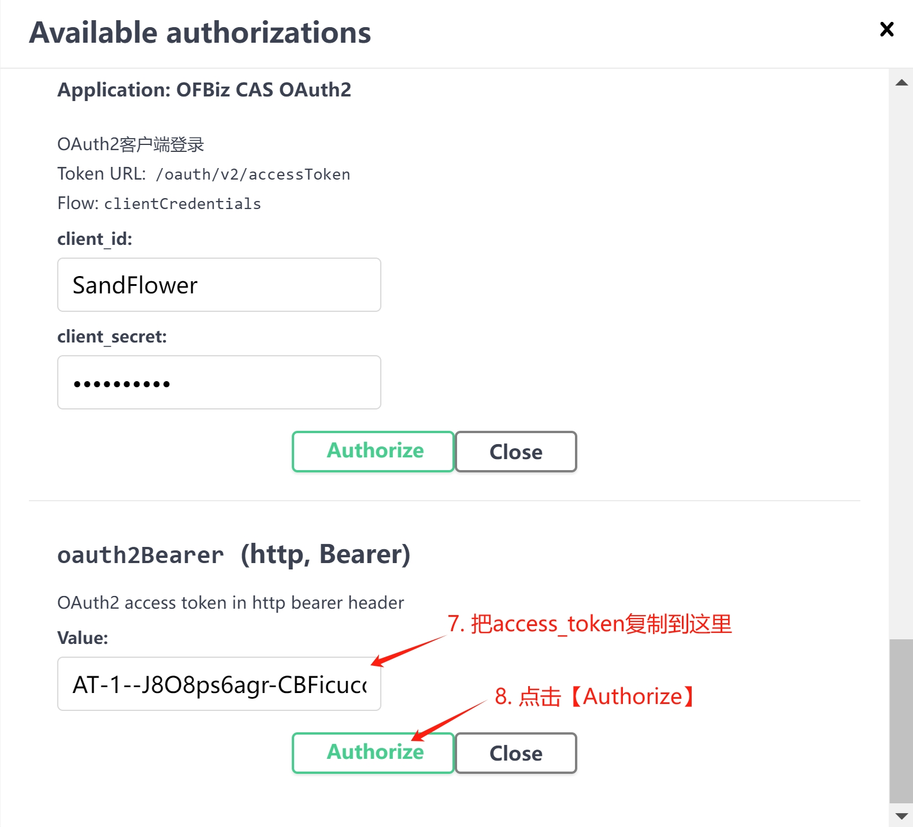

# 支持Swagger OAuth2认证流程

### 网址 /oauth/v2 是如何来的？

/oauth在plugins/cas/ofbiz-component.xml中定义的：

```xml
    <webapp name="oauth2"
        title="OAuth2"
        server="default-server"
        location="webapp/cas-5.3.15.1"
        mount-point="/oauth"
        app-bar-display="false"/>
```

/v2在cas的OAuth20Constants.java中定义的，原本是/oauth2.0：

```java
public interface OAuth20Constants {
...
-    String BASE_OAUTH20_URL = "/oauth2.0";
+    String BASE_OAUTH20_URL = "/v2";
     ...
     }
```

在cas的support/cas-server-support-oauth-core中运行'mvn clean package'，然后把support/cas-server-support-oauth-core/build/libs/cas-server-support-oauth-core-5.3.15.1.jar和support/cas-server-support-oauth/build/libs/cas-server-support-oauth-5.3.15.1.jar复制到本模块的lib目录下。

<br>

### 在webapp/openapi-demo/yaml/demo_zh.yaml中定义5个认证方式

这5个认证方式是：authorizationCode、implicit、password、clientCredentials和bearer，定义和使用方式如下：

```yaml
...
security:
  - codeLogin: []
  - implicitLogin: []
  - passwordLogin: []
  - clientLogin: []
  - oauth2Bearer: []
...
  securitySchemes:
    codeLogin:
      type: oauth2
      description: OAuth2授权码登录
      flows:
        authorizationCode:
          authorizationUrl: 'https://localhost:8443/oauth/v2/authorize'
          tokenUrl: 'https://localhost:8443/oauth/v2/accessToken'

    implicitLogin:
      type: oauth2
      description: OAuth2隐式登录
      flows:
        implicit:
          authorizationUrl: '/oauth/v2/authorize'
          tokenUrl: '/oauth/v2/accessToken'
          scopes:
            'write:pets': modify pets in your account
            'read:pets': read your pets

    passwordLogin:
      type: oauth2
      description: OAuth2密码登录
      flows:
        password:
          tokenUrl: '/oauth/v2/accessToken'

    clientLogin:
      type: oauth2
      description: OAuth2客户端登录
      flows:
        clientCredentials:
          tokenUrl: '/oauth/v2/accessToken'

    oauth2Bearer:
      type: http
      description: OAuth2 access token in http bearer header
      scheme: bearer
```
<br>

### 修改authorizeOauth2和logout

在验证5个认证方式之前，先修改authorizeOauth2和logout方法。authorizeOauth2是解决无法连续登录授权码模式问题。logout部分是解决swagger-ui缺省情况下，无法退出OFBiz登录的问题。

编辑webapp/openapi-demo/swagger-ui-dist/swagger-initializer.js，内容如下：
```js
window.onload = function() {
  window.ui = SwaggerUIBundle({
    urls: [
      {name: 'OAuth2 APIs', url: '/openapi-demo/yaml/oauth2.yaml'},
      {name: 'OAuth2开放接口', url: '/openapi-demo/yaml/oauth2_zh.yaml'},
      {name: 'OpenAPI demo', url: '/openapi-demo/yaml/demo.yaml'},
      {name: '开放接口演示', url: '/openapi-demo/yaml/demo_zh.yaml'},
    ],
    dom_id: '#swagger-ui',
    deepLinking: true,
    presets: [
      SwaggerUIBundle.presets.apis,
      SwaggerUIStandalonePreset
    ],
    plugins: [
      SwaggerUIBundle.plugins.DownloadUrl,
      function() {
        return {
          statePlugins: {
            auth: {
              wrapActions: {
                authorizeOauth2: (oriAction, system) => (payload) => {
                  payload.auth.code = ""
                  return oriAction(payload)
                },
                logout: (oriAction, system) => (payload) => {
                  // external logout
                  fetch(window.location.origin + '/oauth/logout')
                  return oriAction(payload)
                }
              }
            }
          }
        }
      }
    ],
    layout: "StandaloneLayout",
  });

  window.ui.initOAuth({
    appName: 'OFBiz CAS OAuth2',
    clientId: 'SandFlower',
    clientSecret: 'sandflower',
  });
};
```

<br>

### 授权码模式（Authorization code）

在浏览器中访问 https://localhost:8443/openapi-demo/ ，选择【开放接口演示】，出现如下页面：


点击【Authorize】，出现认证浮窗，滚动浮窗到授权码模式，如下图所示：


点击【Authorize】，会弹出一个cas登录标签页，如下图所示：


输入用户名和密码，点击【登录】，出现授权页面：


点击【Allow】，cas登录标签页会关闭，并返回认证浮窗，认证成功的浮窗如下图所示：


点击【Close】，即可关闭认证浮窗，进行API测试。

<br>

### 隐式授权模式（Implicit）

在浏览器中访问 https://localhost:8443/openapi-demo/ ，选择【开放接口演示】；

点击【Authorize】，出现认证浮窗，滚动浮窗到隐式授权模式，如下图所示：


点击【Authorize】，会弹出一个cas登录标签页。

输入用户名和密码，点击【登录】，出现授权页面。

点击【Allow】，cas登录标签页会关闭，并返回认证浮窗，认证成功的浮窗如下图所示：


点击【Close】，即可关闭认证浮窗，进行API测试。

**注意**：OFBiz-CAS模块没有处理scopes参数。

<br>

### 密码模式（password）

在浏览器中访问 https://localhost:8443/openapi-demo/ ，选择【开放接口演示】；

点击【Authorize】，出现认证浮窗，滚动浮窗到密码模式，如下图所示：


输入用户名和密码，点击【Authorize】，即可一步完成登录，认证成功的浮窗如下图所示：


点击【Close】，即可关闭认证浮窗，进行API测试。

<br>

### 客户端模式（Client Credentials）

在浏览器中访问 https://localhost:8443/openapi-demo/ ，选择【开放接口演示】；

点击【Authorize】，出现认证浮窗，滚动浮窗到客户端模式，如下图所示：


点击【Authorize】，即可一步完成登录，认证成功的浮窗如下图所示：


点击【Close】，即可关闭认证浮窗，进行API测试。

<br>

### bearer模式

在浏览器中访问 https://localhost:8443/openapi-demo/ ，选择【OAuth2开放接口】，如下图所示：


页面滚动到/accessToken，点击【Try it out】，如下图所示：


点击【Execute】，即可一步完成认证，得到access_token，复制这个access_token，如下图所示：


选择【开放接口演示】，如下图所示：


点击【Authorize】，出现认证浮窗，在输入框中复制之前的access_token，如下图所示：


点击【Authorize】，即可完成登录，认证成功的浮窗如下图所示：


点击【Close】，即可关闭认证浮窗，进行API测试。

<br>

### 执行/testOpenApiDemoService

上面任何一种认证完成后，都可以进行本接口的测试，如下图所示：


点击【Try it out】，出现输入接口参数的页面，如下图所示：


点击【Execute】，即可完成接口的调用，如下图所示：


<br>

### 参考资料
1. [Swagger OAuth2.0](https://swagger.io/docs/specification/authentication/oauth2/)
2. [Logout button url](https://github.com/swagger-api/swagger-ui/issues/6443)
3. [Plugin API Wrap-Actions](https://swagger.io/docs/open-source-tools/swagger-ui/customization/plugin-api/#wrap-actions)
